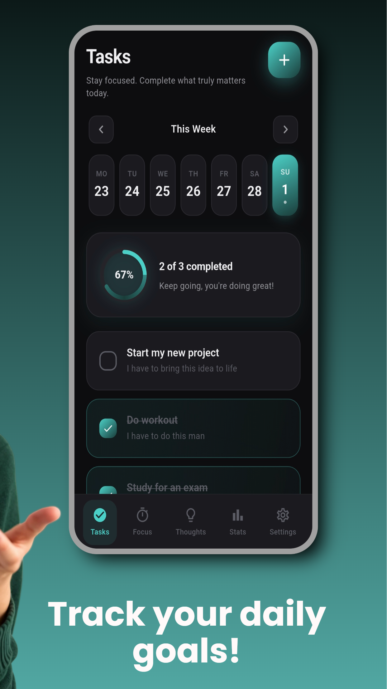
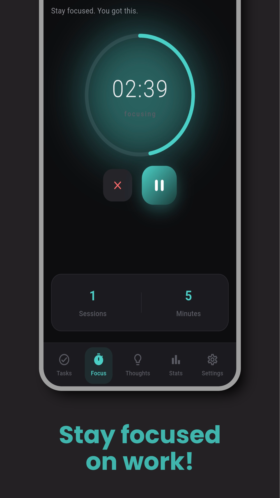
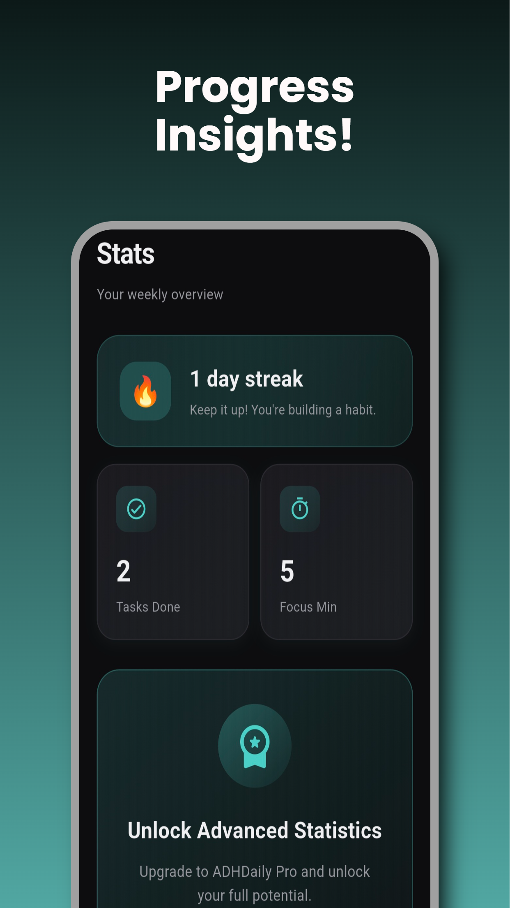
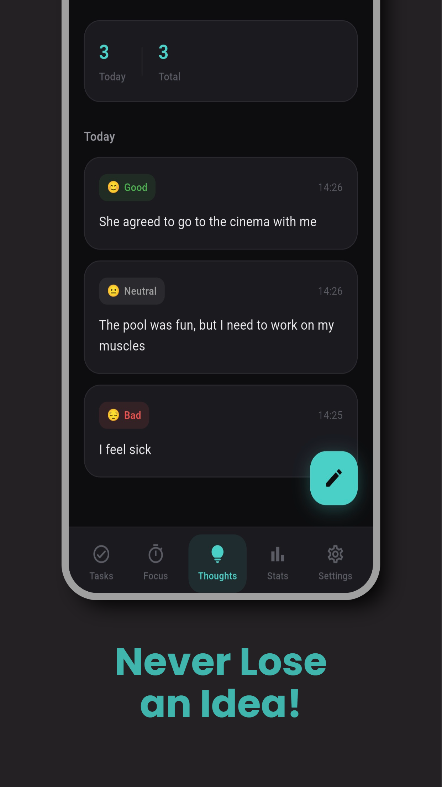
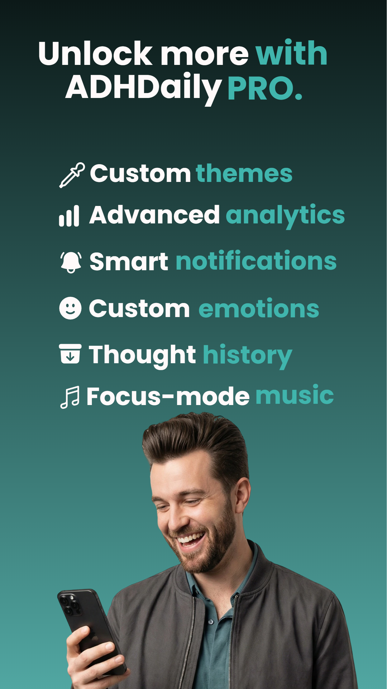

  

  <b>Flutter • Firebase • Mobile App • ADHD Productivity Tool</b>

# ADHDaily – Mobile Habit Tracker 📱

ADHDaily is a production mobile application published on Google Play, designed to help users with ADHD build and maintain daily habits.

👉 [Download on Google Play](https://play.google.com/store/apps/details?id=com.adhdaily.app&hl=pl)

---

## 🎥 App Demo

A short product demo showcasing core features, UX flow and real usage of the application.

👉 [App Demo – ADHDaily](https://www.youtube.com/watch?v=YppHisCOQpg)

---

## 🧩 Problem

People with ADHD often struggle with:
- maintaining consistent habits
- staying organized
- managing focus and productivity
- avoiding cognitive overload from complex apps

Most existing habit tracking apps are not designed for ADHD users and often create additional cognitive load instead of reducing it.

---

## 🚀 Solution

ADHDaily is designed as a minimal, focused and distraction-free productivity tool that helps users build habits without cognitive overload.

The goal is to reduce friction and help users stay consistent with minimal mental effort.

The app emphasizes simplicity, speed and consistency.

---

## ⚙️ Features

- Firebase Authentication (secure user accounts)
- Firestore cloud database
- Habit tracking system
- Focus Timer for deep work sessions
- Thought Journal for mental clarity and reflection
- Progress & statistics tracking
- Notification reminders
- Subscription-based paywall system

---

## 🛠 Tech Stack

- Flutter (UI & app logic)
- Dart
- Firebase (Authentication, Firestore)
- Subscription / revenue integration (Revenue Cat)

---

## 📸 App Preview

### Onboarding

### Task Management

### Focus Timer

### Statistics & Progress

### Thought Journal

### Premium / Subscription

---

## 📈 What I Learned

- building and shipping a production mobile application
- working with Firebase backend services
- implementing authentication and subscription systems
- designing ADHD-friendly UX focused on simplicity and clarity
- product thinking and building user-focused features instead of just code

---

## 🔗 Links

- Google Play: [Download on Google Play](https://play.google.com/store/apps/details?id=com.adhdaily.app&hl=pl)
- Portfolio: https://jakubhul.com
